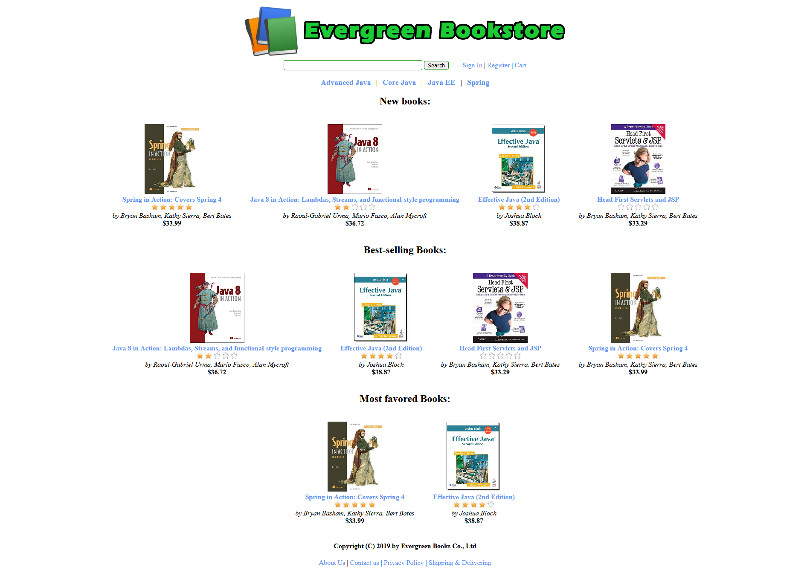
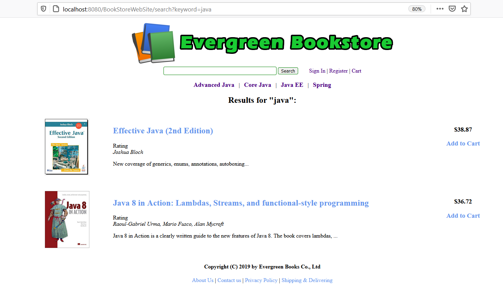
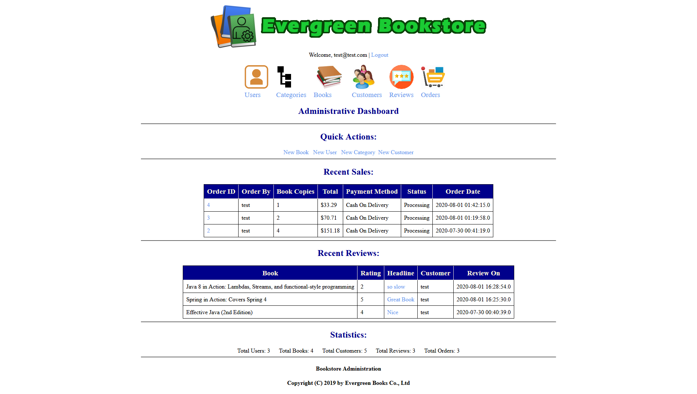

# BookStoreWebSiteProject

BookStoreWebSiteProject is a Project created during a course from [Udemy](https://www.udemy.com/course/java-servlet-jsp-and-hibernate-build-a-complete-website/). An idea of this course is creating an e-commerce website for selling books using Java Servlet, JSP and Hibernate.

## Technologies Used

- Java Servlet for controller layer
- Hibernate framework with JPA for the data access layer
- JSP and JSTL for the view layer
- HTML, CSS, Javascript and jQuery for the view layer
- Design and manage Database with MySQL
- JUnit for unit tests with
- Tomcat server

## Description

The website allows their customers to order the books they want while sitting at home. Also, customers can make reviews for books.
The website allows an admin to manage information about categories, books, customers, reviews, and orders with fundamental operations like view items (listing and detail); create, update, and delete an item. But a customer cannot create a new review or order. In addition, an admin can create an account for another admin user and of course, manage those users.

### Front end

Front end features:

- Homepage: List newly published books; best-selling books; most-favored books
- List books in a category

- View book details

- Search books

- Shopping Cart

- Customer Registration

- Write reviews for books

- Place order (Checkout)

#### Front end Main Page

The website lists all categories in the top menu, which allows a customer to browse books in a specific domain. On the home page, a customer can see the most recently published books (based on the publish date, not by the date on which the book is put onto the website). Then a customer can see the best-selling books (based on the number of orders have been made through the website), and the most favored books (based on their rating and number of reviews).

#### Search

A customer can browse the online book store by category (e.g. Health, Success, Business, Programming, etc) or they can search books by providing a specific keyword e.g. ‘success habits’.
The search result shows books that have either a title or description contain the specified keyword. A customer can add the book to a cart directly in the search result.

#### Book information

 A customer can view basic information about a book like a title, author, description, ISBN number, publish date and price (in USD). In addition, a customer can read reviews of other customers as well as an average rating of a book, which can be ranged from 0 to 5 stars.

#### Authentication and Authorization 

A customer can write a review for a book customer needs to login first. Before logging in, the customer must register an account by providing their personal information like full name, e-mail address, password, phone number, and the information required for shipping such as address, city, zip code and country. Then a customer can login by providing email and password.

### Back end

Back end features:

- Users management (include admin login/logout)

- Category management.

- Book management.

- Review management.

- Customer management.

- Order management.

- Statistics (admin dashboard)

#### Back end Main Page

The backend allows an admin to manage information about categories, books, customers, reviews and orders with fundamental operations like view items (listing and detail); create, update, and delete an item. But the admin cannot create new review or new order. In addition, the admin can create account for another admin user and of course, manage those users.
The admin can manage all categories that are used to classify the books on the website. The only information needed for a category is the category name. The admin cannot delete a category if it contains books. The admin can delete only empty one.
For putting a book onto the website, the admin can upload an image file that is used as the book’s thumbnail. When editing a book, the admin can choose to update the thumbnail or not. And if not, the old image is kept. Note that the admin cannot remove a book if there are reviews and orders on it.
For managing customers, customer’s email is unique. The admin can change a customer’s email, but not to another customer’s email. And a customer cannot be deleted if the admin or she already made reviews or purchased books from the site.
For managing reviews, the admin cannot create a new one. Only customer can write a review. The admin can edit the headline and comment, but not rating, book or customer. Of course the admin can delete any review if it is inappropriate or violates company’s policy.
For managing orders, the admin can update shipping information and status of an order (there will be more options for payment method in future, but there’s only one “Cash on Delivery” option at this stage). In addition, the admin can manage the books picked by the customer. the admin can update quantity, remove or even add other books to the order.
And lastly, an admin can create another admin user with information like email, full name and password.  Then the new user can use his email and password to login to the backend for managing information.
